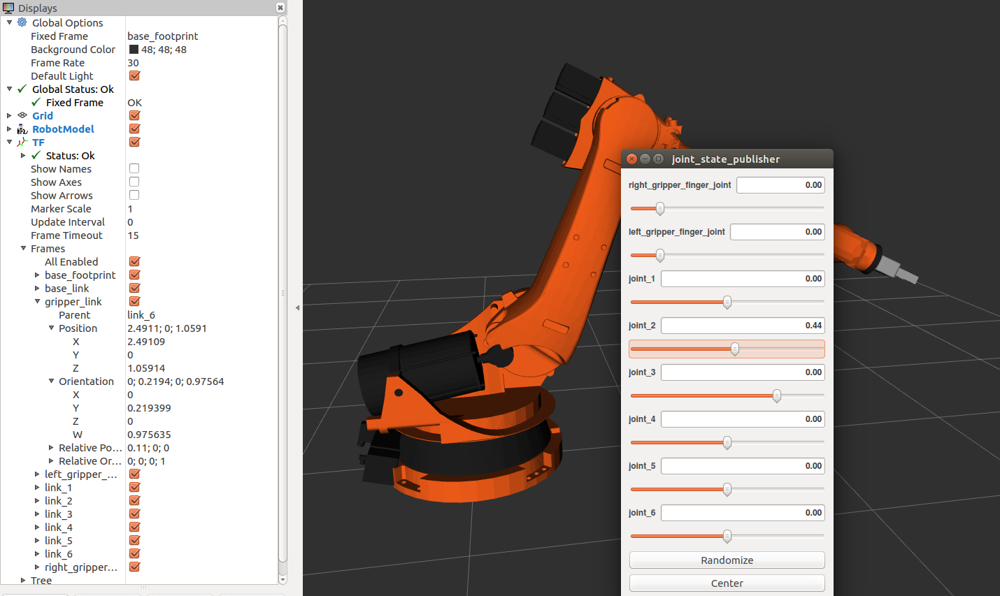
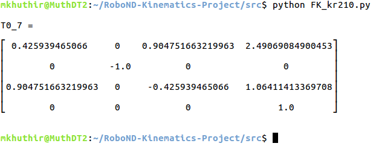
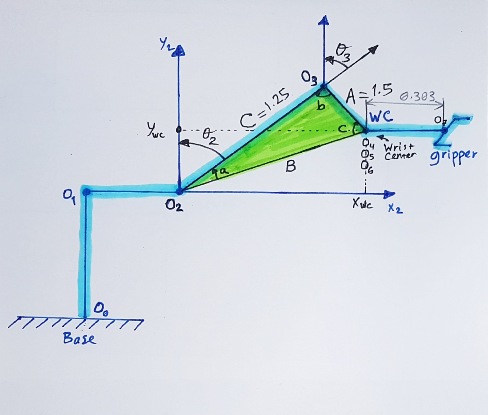

[](https://www.udacity.com/robotics)
# Robotic Arm Pick & Place Project

### Writeup by Muthanna A. Attyah
### Feb 2018

[//]: # (Image References)
[image2]: ./misc_images/misc3.png

## [Rubric](https://review.udacity.com/#!/rubrics/972/view) Points
---

## Forward Kinematic Analysis

### Extracting joint positions and orientations from URDF file.

from the URDF file `kr210.urdf.xacro` we can extract the position xyz and orientation rpy of each joint from **origin** tag in each joint XML section:

for example, from the following fixed base joint XML section:

```xml
 <!-- joints -->
  <joint name="fixed_base_joint" type="fixed">
    <parent link="base_footprint"/>
    <child link="base_link"/>
    <origin xyz="0 0 0" rpy="0 0 0"/>
  </joint>
```
In the **origin** tag:
```xml
<origin xyz="0 0 0" rpy="0 0 0"/>
```
We can see that **xyz="0 0 0"** and **rpy="0 0 0"**. 

Following table is showing complete extracted list for all joints base to gripper:

O | joint | parant | child | x | y | z | r | p | y |
--- | --- | --- | --- | --- | --- | --- | --- | --- | --- |
0 | fixed_base | base_footprint | base_link | 0 | 0 | 0 | 0 | 0 | 0 |
1 | joint_1 | base_link | link_1 | 0 | 0 | 0.33 | 0 | 0 | 0 |
2 | joint_2 | link_1 | link_2 | 0 .35| 0 | 0.42 | 0 | 0 | 0 |
3 | joint_3 | link_2 | link_3 | 0 | 0 | 1.25 | 0 | 0 | 0 |
4 | joint_4 | link_3 | link_4 | 0.96 | 0 | -0.054 | 0 | 0 | 0 |
5 | joint_5 | link_4 | link_5 | 0.54 | 0 | 0 | 0 | 0 | 0 |
6 | joint_6 | link_5 | link_6 | 0.193 | 0 | 0 | 0 | 0 | 0 |
7 | gripper | link_6 | gripper_link | 0.11 | 0 | 0 | 0 | 0 | 0 |
. | **Total (m)** |  |  | **2.153** | 0 | **1.946** | 0 | 0 | 0 |

Now using the above table we can draw the different frames with x and z translations from one frame to another as shown in below figure.

<p align="center">  </p>

Then we can further simplify by combining the last three joints (4,5, and 6) in in joint_5 since their axes in actual KR210 robot intersect at a single point which represent the center of the robot spherical wrist:

<p align="center">  </p>

#### Note that:

**Origin** O(i) = intersection between Xi and Zi axis

**Link Length:** a(i-1) = Zi-1 - Zi along the X(i-1) axis

**Link Offset:** d(i) = X(i-1) - X(i) along Z(i) axis

**Link Twist:** alpha(i-1) = angle from Z(i-1) to Z(i) measured about Xi-1 using right hand rule

**Joint Angle:** theta(i) = angle from X(i-1) to X(i) measured about Zi using right hand rule. all joint angles will be zero at initial Robot state in KR210 except joint 2 which has a -90 degree constant offset between X(1) and X(2).

**Gripper frame:** is the end point that we care about. it is displaced from Frame 6 by a translation along Z(6).


### Kuka KR210 robot DH parameters.

Using the above mentioned formulas we can generate the DH parameters table as following:

Links | i | alpha(i-1) | a(i-1) | d(i) | theta(i) |
:---: | :---: | :---: | :---: | :---: | :---: |
0->1 | 1 | 0 | 0 | 0.75 | q1 |
1->2 | 2 | -90 | 0.35 | 0 | -90+q2 |
2->3 | 3 | 0 |  | 1.25 | q3 |
3->4 | 4 | -90 | -0.05 | 1.5 | q4 |
4->5 | 5 | 90 | 0 | 0 | q5 |
5->6 | 6 | -90 | 0 | 0 | q6 |
6->7 | 7 | 0 | 0 | 0.303 | q7 |

in which q(i) is our input to joint angles (theta(i)).

I will be using python to code the forward kinematics:

To start with, we need the following imports:

```python
import numpy as np
from numpy import array
from sympy import symbols, cos, sin, pi, simplify, sqrt, atan2, pprint
from sympy.matrices import Matrix
```

Python code to represent DH parameters table is:

```python
# DH Table
s = {alpha0:      0, a0:      0, d1:  0.75, q1:        q1,
     alpha1: -pi/2., a1:   0.35, d2:     0, q2: -pi/2.+q2,
     alpha2:      0, a2:   1.25, d3:     0, q3:        q3,
     alpha3: -pi/2., a3: -0.054, d4:  1.50, q4:        q4,
     alpha4:  pi/2., a4:      0, d5:     0, q5:        q5,
     alpha5: -pi/2., a5:      0, d6:     0, q6:        q6,
     alpha6:      0, a6:      0, d7: 0.303, q7:         0}
```

### Creating the individual transformation matrices about each joint:

Using above DH parameter table, we can create individual transforms between various links. DH convention uses four individual transforms: 

<p align="center">  </p>

Using the DH parameter table, we can transform from one frame to another using the following matrix:

<p align="center">  </p>

Python code for a function that will return the individual frame transformation matrix is as following:

```python
# Function to return homogeneous transform matrix

def TF_Mat(alpha, a, d, q):
    TF = Matrix([[            cos(q),           -sin(q),           0,             a],
                 [ sin(q)*cos(alpha), cos(q)*cos(alpha), -sin(alpha), -sin(alpha)*d],
                 [ sin(q)*sin(alpha), cos(q)*sin(alpha),  cos(alpha),  cos(alpha)*d],
                 [                 0,                 0,           0,             1]])
    return TF
```
Then using the following code to subsitute the DH paramaters into the trnasformation matrix: 

```python
   ## Substiute DH_Table
T0_1 = TF_Mat(alpha0, a0, d1, q1).subs(dh)
T1_2 = TF_Mat(alpha1, a1, d2, q2).subs(dh)
T2_3 = TF_Mat(alpha2, a2, d3, q3).subs(dh)
T3_4 = TF_Mat(alpha3, a3, d4, q4).subs(dh)
T4_5 = TF_Mat(alpha4, a4, d5, q5).subs(dh)
T5_6 = TF_Mat(alpha5, a5, d6, q6).subs(dh)
T6_7 = TF_Mat(alpha6, a6, d7, q7).subs(dh)

```

To get the composition of all transforms from base to gripper we simply multiply the individual matricies using the following code:

```python
# Composition of Homogeneous Transforms
# Transform from Base link to end effector (Gripper)
T0_2 = (T0_1 * T1_2) ## (Base) Link_0 to Link_2
T0_3 = (T0_2 * T2_3) ## (Base) Link_0 to Link_3
T0_4 = (T0_3 * T3_4) ## (Base) Link_0 to Link_4
T0_5 = (T0_4 * T4_5) ## (Base) Link_0 to Link_5
T0_6 = (T0_5 * T5_6) ## (Base) Link_0 to Link_6
T0_7 = (T0_6 * T6_7) ## (Base) Link_0 to Link_7 (End Effector)
```

In order to apply correction needed to account for Orientation Difference Between difinition of Gripper Link_7 in URDF versus DH Convention we need to rotate around y then around z axies:

```python
R_y = Matrix([[ cos(-np.pi/2),           0, sin(-np.pi/2), 0],
              [             0,           1,             0, 0],
              [-sin(-np.pi/2),           0, cos(-np.pi/2), 0],
              [             0,           0,             0, 1]])

R_z = Matrix([[    cos(np.pi), -sin(np.pi),             0, 0],
              [    sin(np.pi),  cos(np.pi),             0, 0],
              [             0,           0,             1, 0],
              [             0,           0,             0, 1]])


R_corr = (R_z * R_y)

T_total= (T0_7 * R_corr)
```

To check results we can evaluate the indivdual results when all thetas are equal to zero and compare it to rviz simulator values. I have used prety print (pprint) to show the resulting matrix as shown in below code.

```python
### Numerically evaluate transforms (compare this to output of tf_echo/rviz)

print("\nT0_7 = \n")
pprint(T0_7.evalf(subs={q1: 0, q2: 0, q3: 0, q4: 0, q5: 0, q6: 0}))

```
Remember that the homogeneous transform consists of a rotation part and a translation part as follows:

<p align="center">  </p>

where Px, Py, Pz represent the position of end-effector w.r.t. base_link and RT represent the rotation part using the Roll-Pitch-Yaw angles

In order to compare the output of forward kinematics code with simulator I used the following ROS launch command to run simulator:

```sh
$ roslaunch kuka_arm forward_kinematics.launch
```

Then as shown below; I used RViz tf frames to check values of Px, Py, and Pz in compare to output of python code.

#### Test Case 1: When all thetas = 0 which is the robot initial state.
```python
T0_7.evalf(subs={q1: 0, q2: 0, q3: 0, q4: 0, q5: 0, q6: 0})
```
##### Rviz output:
<p align="center">  </p>

##### Python output:
<p align="center">  </p>

#### Test Case 2: When theta2=0.44 and remaining thetas=0
```python
T0_7.evalf(subs={q1: 0, q2: 0.44, q3: 0, q4: 0, q5: 0, q6: 0})
```
##### Rviz output:
<p align="center">  </p>

##### Python output:
<p align="center">  </p>

[Python code for forward kinematics test `FK_kr210.py` is located on this link](./src/FK_kr210.py)


## Inverse Kinematics Analysis

### Decouple Inverse Kinematics into Inverse Position Kinematics and Inverse Orientation Kinematics

Since the last three joints in KUKA KR210 robot (Joint_4, Joint_5, and Joint_6) are revolute and their joint axes intersect at a single point (Joint_5), we have a case of spherical wrist with joint_5 being the common intersection point; the wrist center (WC). This allows us to kinematically decouple the IK problem into Inverse Position and Inverse Orientation problems.


First step is to get the end-effector poistion(Px, Py, PZ) and orientation (roll, pitch, yaw) from the test cases data class as shown in below code:

```python
   # Requested end-effector (EE) position
    px = req.poses[x].position.x
    py = req.poses[x].position.y
    pz = req.poses[x].position.z

    # Requested end-effector (EE) orientation
    (roll,pitch,yaw) = tf.transformations.euler_from_quaternion(
        [req.poses[x].orientation.x,
         req.poses[x].orientation.y,
         req.poses[x].orientation.z,
         req.poses[x].orientation.w])
```

We can use the following formula to find wrist center (WC):

**Rrpy = Rot(Z, yaw) * Rot(Y, pitch) * Rot(X, roll) * R_corr**

We will need rotation matrix for the end-effector (Rot_EE=RotX*RotY*RotZ) and orientation difference correction matrix (Rot_corr) (as discussed in FK section) to apply on the obtained (roll, pitch, yaw):

```python
 # Find EE rotation matrix RPY (Roll, Pitch, Yaw)
    r,p,y = symbols('r p y')

    # Roll
    ROT_x = Matrix([[       1,       0,       0],
                    [       0,  cos(r), -sin(r)],
                    [       0,  sin(r),  cos(r)]])
    # Pitch
    ROT_y = Matrix([[  cos(p),       0,  sin(p)],
                    [       0,       1,       0],
                    [ -sin(p),       0,  cos(p)]])
    # Yaw
    ROT_z = Matrix([[  cos(y), -sin(y),       0],
                    [  sin(y),  cos(y),       0],
                    [       0,       0,       1]])

    ROT_EE = ROT_z * ROT_y * ROT_x

    # Correction Needed to Account for Orientation Difference Between
    # Difinition of Gripper Link_G in URDF versus DH Convention

    ROT_corr = ROT_x.subs(y, radians(180)) * ROT_y.subs(p, radians(-90))
    ROT_EE = ROT_EE * ROT_corr
    ROT_EE = ROT_EE.subs({'r': roll, 'p': pitch, 'y': yaw})
    
    EE = Matrix([[px],
                 [py],
                 [pz]])
```

Wrist Center postion/orientation can be obtained from applying the corrected rotation matrix on end-effector position/orientation with a inverse trnaslation of -0.303 (which is value of d7 in DH table).

```python
    # Calculate Wrest Center
    WC = EE - (0.303) * ROT_EE[:,2]
```

<p align="center">  </p>

```python
    # Calculate theat1
    theta1 = atan2(WC[1],WC[0])
```

We have a triangle (the green color in below figure) with two sides known to us (side_a = d4 = 1.5) and (side_c = a2 = 1.25), the 3rd side can be calcualted as following:

Then we can calculate all of the three inner angles of the traingle from the known three sides (SSS type).

Below is the same in Python code:

```python
    #SSS triangle for theta2 and theta3
    side_a = 1.501
    side_c = 1.25
    side_b = sqrt(pow((sqrt(WC[0]*WC[0] + WC[1]*WC[1]) - 0.35), 2) + pow((WC[2] - 0.75), 2))
    
    angle_a = acos((side_b * side_b + side_c * side_c - side_a * side_a) / (2 * side_b * side_c))
    angle_b = acos((side_a * side_a + side_c * side_c - side_b * side_b) / (2 * side_a * side_c))
    angle_c = acos((side_a * side_a + side_b * side_b - side_c * side_c) / (2 * side_a * side_b))

    theta2 = pi /2 - angle_a - atan2(WC[2]-0.75, sqrt(WC[0]*WC[0]+WC[1]*WC[1])-0.35)
    theta3 = pi /2 - (angle_b+0.036) # 0.036 accounts for sag in link4 of -0.054m
```
<p align="center">  </p>


```python
    # Extract rotation matrix R0_3 from transformation matrix T0_3 the substiute angles q1-3
    R0_3 = T0_1[0:3,0:3] * T1_2[0:3,0:3] * T2_3[0:3,0:3]
    R0_3 = R0_3.evalf(subs={q1: theta1, q2: theta2, q3:theta3})

    # Get rotation matrix R3_6 from (inverse of R0_3 * R_EE)
    R3_6 = R0_3.inv(method="LU") * ROT_EE
```

```python
    # Euler angles from rotation matrix
    theta4 = atan2(R3_6[2,2], -R3_6[0,2])
    theta5 = atan2(sqrt(R3_6[0,2]*R3_6[0,2] + R3_6[2,2]*R3_6[2,2]),R3_6[1,2])
    theta6 = atan2(-R3_6[1,1],R3_6[1,0])
```


```python
FK = T0_7.evalf(subs={q1:theta1,q2:theta2,q3:theta3,q4:theta4,q5:theta5,q6:theta6})
```

The rest of the code will utilize this wrist center position, and the thetas to calculate the corresponding errors. Using these error values as a basis, We can guage how well our current IK performs.


[Python code for forward kinematics test `IK_debug.py` is located on this link](./src/IK_debug.py)

### Project Implementation

#### 1. Fill in the `IK_server.py` file with properly commented python code for calculating Inverse Kinematics based on previously performed Kinematic Analysis. Your code must guide the robot to successfully complete 8/10 pick and place cycles. Briefly discuss the code you implemented and your results. 

IK_server.py must contain properly commented code. The robot must track the planned trajectory and successfully complete pick and place operation. Your writeup must include explanation for the code and a discussion on the results.


[Python code for forward kinematics test `IK_server.py` is located on this link](./src/kuka_arm/scripts/IK_server.py)


### Issues faced during project

* Handling VMWare virtual machine image was difficult considering its big size (4.5+GB compressed and 12+ GB uncompressed). I decided to install ROS Kinetics and Gazebo 7.9 on Ubuntu 16.04 LTS with all its required dependencies and updates. It took me some time but I felt that it was much more beneficial in learning Ubuntu/ROS/Gazebo/RViz installation, update, upgrade, and package management tricks.

* Slowness of the forward and inverse kinematics was one of the issues I faced at the initial stage of the code writing/testing. I was able to improve performance by removing unwanted sympy "simplify" calls then further improve it by converting some of the parts from sympy to numpy [see this link for more info.](https://stackoverflow.com/questions/45796747/are-sympy-matrices-really-that-slow).


### Future improvements

* I recommend adding ROS/Ubuntu/Gazebo manual installation as one of the supported platforms for this ND and show required steps which will be a great addon value for students to learn how to install those great tools on their own PCs or DevBoards. Starting a new dedicated ROS NanoDegree will be great, and for sure I will be one of the first to enroll in it.

### Standout submission
To have a standout submission, calculate and plot the error in end-effector pose generated by your joint angle commands. You can do this by calculating end-effector poses via Forward Kinematics using your code output (which is a set of joint angles) and comparing it with the end-effector poses you received as input.
