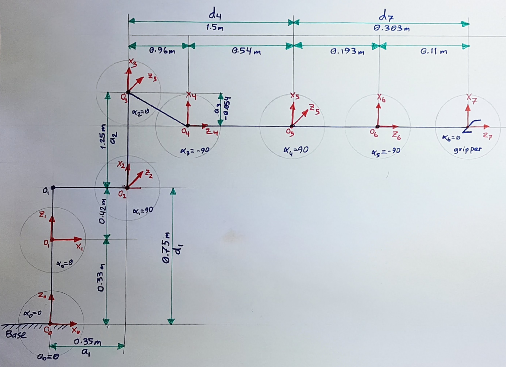
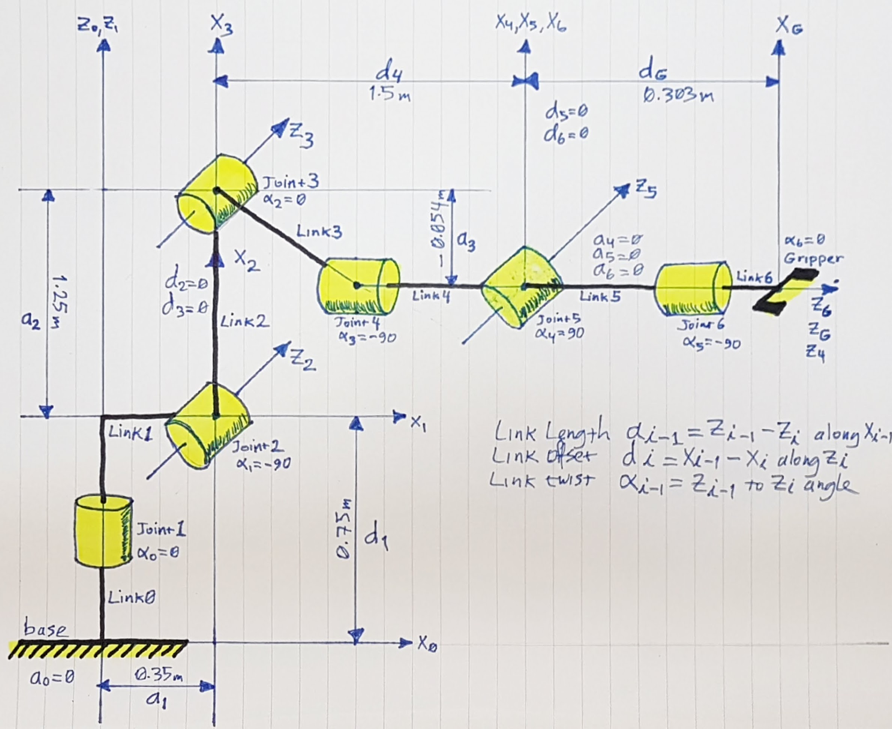

[](https://www.udacity.com/robotics)
# Robotic Arm Pick & Place Project

## Writeup by Muthanna A. Attyah
## Feb 2018

[//]: # (Image References)

[image2]: ./misc_images/misc3.png
[image3]: ./misc_images/misc2.png

## [Rubric](https://review.udacity.com/#!/rubrics/972/view) Points
---

### Kinematic Analysis

#### Extracting joint positions and orientations from URDF file.

from the URDF file `kr210.urdf.xacro` we can extract the position xyz and orientation rpy of each joint from **origin** tag in each joint XML section:

for example, from the following fixed base joint XML section:

```xml
 <!-- joints -->
  <joint name="fixed_base_joint" type="fixed">
    <parent link="base_footprint"/>
    <child link="base_link"/>
    <origin xyz="0 0 0" rpy="0 0 0"/>
  </joint>
```
In the **origin** tag:
```xml
<origin xyz="0 0 0" rpy="0 0 0"/>
```
We can see that **xyz="0 0 0"** and **rpy="0 0 0"**. Following table is showing complete extracted list for all joints base to gripper:

O | joint | parant | child | x | y | z | r | p | y |
--- | --- | --- | --- | --- | --- | --- | --- | --- | --- |
0 | fixed_base | base_footprint | base_link | 0 | 0 | 0 | 0 | 0 | 0 |
1 | joint_1 | base_link | link_1 | 0 | 0 | 0.33 | 0 | 0 | 0 |
2 | joint_2 | link_1 | link_2 | 0 .35| 0 | 0.42 | 0 | 0 | 0 |
3 | joint_3 | link_2 | link_3 | 0 | 0 | 1.25 | 0 | 0 | 0 |
4 | joint_4 | link_3 | link_4 | 0.96 | 0 | -0.054 | 0 | 0 | 0 |
5 | joint_5 | link_4 | link_5 | 0.54 | 0 | 0 | 0 | 0 | 0 |
6 | joint_6 | link_5 | link_6 | 0.193 | 0 | 0 | 0 | 0 | 0 |
7 | gripper | link_6 | gripper_link | 0.11 | 0 | 0 | 0 | 0 | 0 |
. | **Total (m)** |  |  | 2.153 | 0 | 1.946 | 0 | 0 | 0 |

Below figure is shoing the different frames with x and z translations from one frame to another.

<p align="center">  </p>

Below figure is showing the KR210 forward kinematics diagram using above joint data:

<p align="center">  </p>

Note that:
---
**Origin** O(i) = intersection between Xi and Zi axies

**Link Length:** a(i-1) = Zi-1 - Zi along the X(i-1) axis

**Link Offset:** d(i) = X(i-1) - X(i) along Z(i) axis

**Link Twist:** alpha(i-1) = angle from Z(i-1) to Z(i) mesured about Xi-1 using right hand rule

**Joint Angle:** theta(i) = angle from X(i-1) to X(i) mesured about Zi using right hand rule. all joint angles will be zero at initial Robot state in KR210 except joint 2 which has a -90 degree constant offset between X(1) and X(2).

**Gripper frame:** is the end point that we care about. it is displaced from Frame 6 by a translation along Z(6).


### Kuka KR210 robot DH parameters.

Using the above mentioned formulas we can generate the DH parameters table as following:

Links | i | alpha(i-1) | a(i-1) | d(i) | theta(i) |
:---: | :---: | :---: | :---: | :---: | :---: |
0->1 | 1 | 0 | 0 | 0.75 | q1 |
1->2 | 2 | -90 | 0.35 | 0 | -90+q2 |
2->3 | 3 | 0 |  | 1.25 | q3 |
3->4 | 4 | -90 | -0.05 | 1.5 | q4 |
4->5 | 5 | 90 | 0 | 0 | q5 |
5->6 | 6 | -90 | 0 | 0 | q6 |
6->7 | 7 | 0 | 0 | 0.303 | q7 |

in which q(i) is our input to joint angles (theta(i)).

Python code to represent this table is:

```python
# DH Table
s = {alpha0:      0, a0:      0, d1:  0.75, q1:        q1,
     alpha1: -pi/2., a1:   0.35, d2:     0, q2: -pi/2.+q2,
     alpha2:      0, a2:   1.25, d3:     0, q3:        q3,
     alpha3: -pi/2., a3: -0.054, d4:  1.50, q4:        q4,
     alpha4:  pi/2., a4:      0, d5:     0, q5:        q5,
     alpha5: -pi/2., a5:      0, d6:     0, q6:        q6,
     alpha6:      0, a6:      0, d7: 0.303, q7:         0}
```

### Creating the individual transformation matrices about each joint:

Using the DH parameter table, we can transform from one frame to another using the following matrix

Python code to do the individual transformations is as following:

```python
    ## (Base) Link_0 to Link_1
    T0_1 = Matrix([ [             cos(q1),            -sin(q1),            0,              a0],
                    [ sin(q1)*cos(alpha0), cos(q1)*cos(alpha0), -sin(alpha0), -sin(alpha0)*d1],
                    [ sin(q1)*sin(alpha0), cos(q1)*sin(alpha0),  cos(alpha0),  cos(alpha0)*d1],
                    [                   0,                   0,            0,               1]])
    ## Link_1 to Link_2
    T1_2 = Matrix([ [             cos(q2),            -sin(q2),            0,              a1],
                    [ sin(q2)*cos(alpha1), cos(q2)*cos(alpha1), -sin(alpha1), -sin(alpha1)*d2],
                    [ sin(q2)*sin(alpha1), cos(q2)*sin(alpha1),  cos(alpha1),  cos(alpha1)*d2],
                    [                   0,                   0,            0,               1]])
    ## Link_2 to Link_3
    T2_3 = Matrix([ [             cos(q3),            -sin(q3),            0,              a2],
                    [ sin(q3)*cos(alpha2), cos(q3)*cos(alpha2), -sin(alpha2), -sin(alpha2)*d3],
                    [ sin(q3)*sin(alpha2), cos(q3)*sin(alpha2),  cos(alpha2),  cos(alpha2)*d3],
                    [                   0,                   0,            0,               1]])
    ## Link_3 to Link_4
    T3_4 = Matrix([ [             cos(q4),            -sin(q4),            0,              a3],
                    [ sin(q4)*cos(alpha3), cos(q4)*cos(alpha3), -sin(alpha3), -sin(alpha3)*d4],
                    [ sin(q4)*sin(alpha3), cos(q4)*sin(alpha3),  cos(alpha3),  cos(alpha3)*d4],
                    [                   0,                   0,            0,               1]])
    ## Link_4 to Link_5
    T4_5 = Matrix([ [             cos(q5),            -sin(q5),            0,              a4],
                    [ sin(q5)*cos(alpha4), cos(q5)*cos(alpha4), -sin(alpha4), -sin(alpha4)*d5],
                    [ sin(q5)*sin(alpha4), cos(q5)*sin(alpha4),  cos(alpha4),  cos(alpha4)*d5],
                    [                   0,                   0,            0,               1]])
    ## Link_5 to Link_6
    T5_6 = Matrix([ [             cos(q6),            -sin(q6),            0,              a5],
                    [ sin(q6)*cos(alpha5), cos(q6)*cos(alpha5), -sin(alpha5), -sin(alpha5)*d6],
                    [ sin(q6)*sin(alpha5), cos(q6)*sin(alpha5),  cos(alpha5),  cos(alpha5)*d6],
                    [                   0,                   0,            0,               1]])
    ## Link_6 to Link_7 (end effector)
    T6_7 = Matrix([ [             cos(q7),            -sin(q7),            0,              a6],
                    [ sin(q7)*cos(alpha6), cos(q7)*cos(alpha6), -sin(alpha6), -sin(alpha6)*d7],
                    [ sin(q7)*sin(alpha6), cos(q7)*sin(alpha6),  cos(alpha6),  cos(alpha6)*d7],
                    [                   0,                   0,            0,               1]])
```
Then using the following code to subsitute the DH paramaters into the trnasformation matricies: 

```python
    ## Substiute DH_Table
    T0_1 = T0_1.subs(s)
    T1_2 = T1_2.subs(s)
    T2_3 = T2_3.subs(s)
    T3_4 = T3_4.subs(s)
    T4_5 = T4_5.subs(s)
    T5_6 = T5_6.subs(s)
    T6_7 = T6_7.subs(s)
```

To get the composition of all transforms from base to gripper we simply multiply the individual matricies using the following code:

```python
    # Composition of Homogeneous Transforms
    # Transform from Base link to end effector
    T0_7 = T0_1 * T1_2 * T2_3 * T3_4 * T4_5 * T5_6 * T6_7
 ```

In order to apply correction needed to account for Orientation Difference Between difinition of Gripper Link_7 in URDF versus DH Convention we need to rotate around y then around z axies:

```python
R_y = Matrix([[ cos(-np.pi/2),           0, sin(-np.pi/2), 0],
              [             0,           1,             0, 0],
              [-sin(-np.pi/2),           0, cos(-np.pi/2), 0],
              [             0,           0,             0, 1]])

R_z = Matrix([[    cos(np.pi), -sin(np.pi),             0, 0],
              [    sin(np.pi),  cos(np.pi),             0, 0],
              [             0,           0,             1, 0],
              [             0,           0,             0, 1]])


R_corr = simplify(R_z * R_y)

T_total = simplify(T0_7 * R_corr)
```

To check results we can evaluate the indivdual results when all thetas is equal zeros and compare it to simulator values.

```python
### Numerically evaluate transforms (compare this to output of tf_echo)
pprint("T0_1 = ",T0_1.evalf(subs={q1: 0, q2: 0, q3: 0, q4: 0, q5: 0, q6: 0}))
pprint("T0_2 = ",T0_2.evalf(subs={q1: 0, q2: 0, q3: 0, q4: 0, q5: 0, q6: 0}))
pprint("T0_3 = ",T0_3.evalf(subs={q1: 0, q2: 0, q3: 0, q4: 0, q5: 0, q6: 0}))
pprint("T0_4 = ",T0_4.evalf(subs={q1: 0, q2: 0, q3: 0, q4: 0, q5: 0, q6: 0}))
pprint("T0_5 = ",T0_5.evalf(subs={q1: 0, q2: 0, q3: 0, q4: 0, q5: 0, q6: 0}))
pprint("T0_6 = ",T0_6.evalf(subs={q1: 0, q2: 0, q3: 0, q4: 0, q5: 0, q6: 0}))
```

or we can compare the full composition of trnasforms:

```python
print("T_total Matrix : "),
pprint(T_total.evalf(subs={q1: 0, q2: 0, q3: 0, q4: 0, q5: 0, q6: 0}))
```

#### 2. Using the DH parameter table you derived earlier, create individual transformation matrices about each joint. In addition, also generate a generalized homogeneous transform between base_link and gripper_link using only end-effector(gripper) pose.

Your writeup should contain individual transform matrices about each joint using the DH table and a homogeneous transform matrix from base_link to gripper_link using only the position and orientation of the gripper_link. These matrices can be created using any software of your choice or hand written. Also include an explanation on how you created these matrices.


#### 3. Decouple Inverse Kinematics problem into Inverse Position Kinematics and inverse Orientation Kinematics; doing so derive the equations to calculate all individual joint angles.

Based on the geometric Inverse Kinematics method described here, breakdown the IK problem into Position and Orientation problems. Derive the equations for individual joint angles. Your writeup must contain details about the steps you took to arrive at those equations. Add figures where necessary. If any given joint has multiple solutions, select the best solution and provide explanation about your choice (Hint: Observe the active robot workspace in this project and the fact that some joints have physical limits).


And here's where you can draw out and show your math for the derivation of your theta angles. 

![alt text][image2]

### Project Implementation

#### 1. Fill in the `IK_server.py` file with properly commented python code for calculating Inverse Kinematics based on previously performed Kinematic Analysis. Your code must guide the robot to successfully complete 8/10 pick and place cycles. Briefly discuss the code you implemented and your results. 

IK_server.py must contain properly commented code. The robot must track the planned trajectory and successfully complete pick and place operation. Your writeup must include explanation for the code and a discussion on the results.

Here I'll talk about the code, what techniques I used, what worked and why, where the implementation might fail and how I might improve it if I were going to pursue this project further.  

And just for fun, another example image:
![alt text][image3]


### Standout submission

To have a standout submission, calculate and plot the error in end-effector pose generated by your joint angle commands. You can do this by calculating end-effector poses via Forward Kinematics using your code output (which is a set of joint angles) and comparing it with the end-effector poses you received as input.
