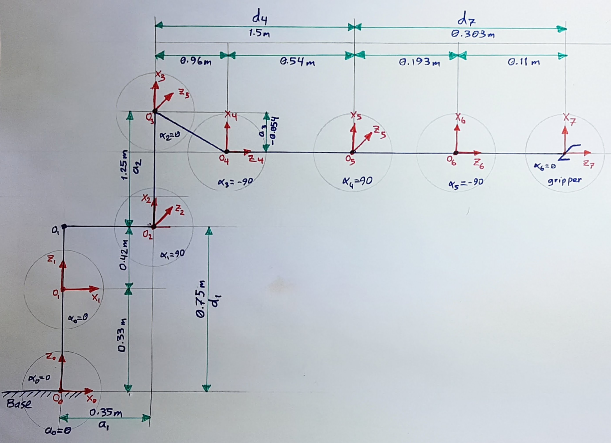
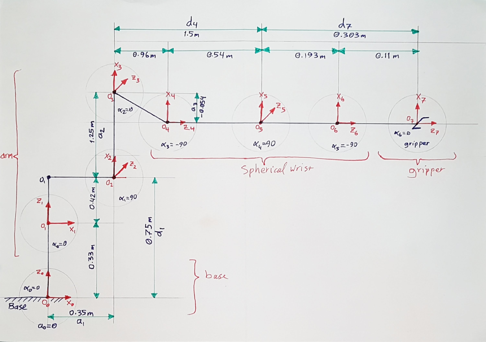
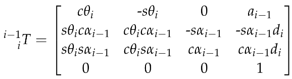
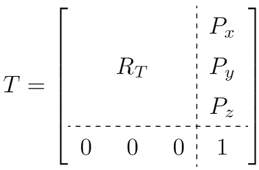

[](https://www.udacity.com/robotics)
# Robotic Arm Pick & Place Project

### Writeup by Muthanna A. Attyah
### Feb 2018

[//]: # (Image References)
[image2]: ./misc_images/misc3.png

## [Rubric](https://review.udacity.com/#!/rubrics/972/view) Points
---

## Forward Kinematic Analysis

#### Extracting joint positions and orientations from URDF file.

from the URDF file `kr210.urdf.xacro` we can extract the position xyz and orientation rpy of each joint from **origin** tag in each joint XML section:

for example, from the following fixed base joint XML section:

```xml
 <!-- joints -->
  <joint name="fixed_base_joint" type="fixed">
    <parent link="base_footprint"/>
    <child link="base_link"/>
    <origin xyz="0 0 0" rpy="0 0 0"/>
  </joint>
```
In the **origin** tag:
```xml
<origin xyz="0 0 0" rpy="0 0 0"/>
```
We can see that **xyz="0 0 0"** and **rpy="0 0 0"**. Following table is showing complete extracted list for all joints base to gripper:

O | joint | parant | child | x | y | z | r | p | y |
--- | --- | --- | --- | --- | --- | --- | --- | --- | --- |
0 | fixed_base | base_footprint | base_link | 0 | 0 | 0 | 0 | 0 | 0 |
1 | joint_1 | base_link | link_1 | 0 | 0 | 0.33 | 0 | 0 | 0 |
2 | joint_2 | link_1 | link_2 | 0 .35| 0 | 0.42 | 0 | 0 | 0 |
3 | joint_3 | link_2 | link_3 | 0 | 0 | 1.25 | 0 | 0 | 0 |
4 | joint_4 | link_3 | link_4 | 0.96 | 0 | -0.054 | 0 | 0 | 0 |
5 | joint_5 | link_4 | link_5 | 0.54 | 0 | 0 | 0 | 0 | 0 |
6 | joint_6 | link_5 | link_6 | 0.193 | 0 | 0 | 0 | 0 | 0 |
7 | gripper | link_6 | gripper_link | 0.11 | 0 | 0 | 0 | 0 | 0 |
. | **Total (m)** |  |  | **2.153** | 0 | **1.946** | 0 | 0 | 0 |

Below figure is shoing the different frames with x and z translations from one frame to another.

<p align="center">  </p>

Below figure is showing the KR210 forward kinematics diagram using above joint data:

<p align="center">  </p>

Note that:
---
**Origin** O(i) = intersection between Xi and Zi axis

**Link Length:** a(i-1) = Zi-1 - Zi along the X(i-1) axis

**Link Offset:** d(i) = X(i-1) - X(i) along Z(i) axis

**Link Twist:** alpha(i-1) = angle from Z(i-1) to Z(i) measured about Xi-1 using right hand rule

**Joint Angle:** theta(i) = angle from X(i-1) to X(i) measured about Zi using right hand rule. all joint angles will be zero at initial Robot state in KR210 except joint 2 which has a -90 degree constant offset between X(1) and X(2).

**Gripper frame:** is the end point that we care about. it is displaced from Frame 6 by a translation along Z(6).


#### Kuka KR210 robot DH parameters.

Using the above mentioned formulas we can generate the DH parameters table as following:

Links | i | alpha(i-1) | a(i-1) | d(i) | theta(i) |
:---: | :---: | :---: | :---: | :---: | :---: |
0->1 | 1 | 0 | 0 | 0.75 | q1 |
1->2 | 2 | -90 | 0.35 | 0 | -90+q2 |
2->3 | 3 | 0 |  | 1.25 | q3 |
3->4 | 4 | -90 | -0.05 | 1.5 | q4 |
4->5 | 5 | 90 | 0 | 0 | q5 |
5->6 | 6 | -90 | 0 | 0 | q6 |
6->7 | 7 | 0 | 0 | 0.303 | q7 |

in which q(i) is our input to joint angles (theta(i)).

I will be using python to code the forward kinematics:

To start with, we need the following imports:

```python
import numpy as np
from numpy import array
from sympy import symbols, cos, sin, pi, simplify, sqrt, atan2, pprint
from sympy.matrices import Matrix
```

Python code to represent DH parameters table is:

```python
# DH Table
s = {alpha0:      0, a0:      0, d1:  0.75, q1:        q1,
     alpha1: -pi/2., a1:   0.35, d2:     0, q2: -pi/2.+q2,
     alpha2:      0, a2:   1.25, d3:     0, q3:        q3,
     alpha3: -pi/2., a3: -0.054, d4:  1.50, q4:        q4,
     alpha4:  pi/2., a4:      0, d5:     0, q5:        q5,
     alpha5: -pi/2., a5:      0, d6:     0, q6:        q6,
     alpha6:      0, a6:      0, d7: 0.303, q7:         0}
```

#### Creating the individual transformation matrices about each joint:

Using above DH parameter table, we can create individual transforms between various links. DH convention uses four individual transforms: 

<p align="center">  </p>

Using the DH parameter table, we can transform from one frame to another using the following matrix:

<p align="center">  </p>

Python code for a function that will return the individual frame transformation matrix is as following:

```python
# Function to return homogeneous transform matrix

def TF_Mat(alpha, a, d, q):
    TF = Matrix([[            cos(q),           -sin(q),           0,             a],
                 [ sin(q)*cos(alpha), cos(q)*cos(alpha), -sin(alpha), -sin(alpha)*d],
                 [ sin(q)*sin(alpha), cos(q)*sin(alpha),  cos(alpha),  cos(alpha)*d],
                 [                 0,                 0,           0,             1]])
    return TF
```
Then using the following code to subsitute the DH paramaters into the trnasformation matrix: 

```python
   ## Substiute DH_Table
T0_1 = TF_Mat(alpha0, a0, d1, q1).subs(dh)
T1_2 = TF_Mat(alpha1, a1, d2, q2).subs(dh)
T2_3 = TF_Mat(alpha2, a2, d3, q3).subs(dh)
T3_4 = TF_Mat(alpha3, a3, d4, q4).subs(dh)
T4_5 = TF_Mat(alpha4, a4, d5, q5).subs(dh)
T5_6 = TF_Mat(alpha5, a5, d6, q6).subs(dh)
T6_7 = TF_Mat(alpha6, a6, d7, q7).subs(dh)

```

To get the composition of all transforms from base to gripper we simply multiply the individual matricies using the following code:

```python
# Composition of Homogeneous Transforms
# Transform from Base link to end effector (Gripper)
T0_2 = (T0_1 * T1_2) ## (Base) Link_0 to Link_2
T0_3 = (T0_2 * T2_3) ## (Base) Link_0 to Link_3
T0_4 = (T0_3 * T3_4) ## (Base) Link_0 to Link_4
T0_5 = (T0_4 * T4_5) ## (Base) Link_0 to Link_5
T0_6 = (T0_5 * T5_6) ## (Base) Link_0 to Link_6
T0_7 = (T0_6 * T6_7) ## (Base) Link_0 to Link_E (End Effector)
```

In order to apply correction needed to account for Orientation Difference Between difinition of Gripper Link_7 in URDF versus DH Convention we need to rotate around y then around z axies:

```python
R_y = Matrix([[ cos(-np.pi/2),           0, sin(-np.pi/2), 0],
              [             0,           1,             0, 0],
              [-sin(-np.pi/2),           0, cos(-np.pi/2), 0],
              [             0,           0,             0, 1]])

R_z = Matrix([[    cos(np.pi), -sin(np.pi),             0, 0],
              [    sin(np.pi),  cos(np.pi),             0, 0],
              [             0,           0,             1, 0],
              [             0,           0,             0, 1]])


R_corr = (R_z * R_y)

T_total= (T0_7 * R_corr)
```

To check results we can evaluate the indivdual results when all thetas are equal to zero and compare it to rviz simulator values. I have used prety print (pprint) to show the resulting matrix as shown in below code.

```python
### Numerically evaluate transforms (compare this to output of tf_echo/rviz)
#print("\nT0_1 = \n")
#pprint(T0_1.evalf(subs={q1: 0, q2: 0, q3: 0, q4: 0, q5: 0, q6: 0}))
#print("\nT0_2 = \n")
#pprint(T0_2.evalf(subs={q1: 0, q2: 0, q3: 0, q4: 0, q5: 0, q6: 0}))
#print("\nT0_3 = \n")
#pprint(T0_3.evalf(subs={q1: 0, q2: 0, q3: 0, q4: 0, q5: 0, q6: 0}))
#print("\nT0_4 = \n")
#pprint(T0_4.evalf(subs={q1: 0, q2: 0, q3: 0, q4: 0, q5: 0, q6: 0}))
#print("\nT0_5 = \n")
#pprint(T0_5.evalf(subs={q1: 0, q2: 0, q3: 0, q4: 0, q5: 0, q6: 0}))
#print("\nT0_6 = \n")
#pprint(T0_6.evalf(subs={q1: 0, q2: 0, q3: 0, q4: 0, q5: 0, q6: 0}))
print("\nT0_7 = \n")
pprint(T0_7.evalf(subs={q1: 0, q2: 0, q3: 0, q4: 0, q5: 0, q6: 0}))

#print("\nT_total Matrix : \n")
#pprint(T_total.evalf(subs={q1: 0, q2: 0, q3: 0, q4: 0, q5: 0, q6: 0}))

```
Remember that the homogeneous transform consists of a rotation part and a translation part as follows:

<p align="center">  </p>

where Px, Py, Pz represent the position of end-effector w.r.t. base_link and RT represent the rotation part using the Roll-Pitch-Yaw angles

In order to compare the output of forward kinematics code with simulator I used the following ROS launch command to run simulator:

```sh
$ roslaunch kuka_arm forward_kinematics.launch
```

Then as shown below; I used tf frames to check values of Px, Py, and Pz.

<p align="center">  </p>

[The full code for forward kinematics test `FK_kr210.py` is located in this link](./src/FK_kr210.py)


## Inverse Kinematics Analysis

#### Decouple Inverse Kinematics problem into Inverse Position Kinematics and inverse Orientation Kinematics

Since the last three joints in KUKA KR210 robot are revolute and their joint axes intersect at a single point, we have a case of spherical wrist with joint_5 being the common intersection point we will call it the wrist center (WC). This allows us to kinematically decouple the IK problem into Inverse Position and Inverse Orientation problems.


doing so derive the equations to calculate all individual joint angles.

Based on the geometric Inverse Kinematics method described here, breakdown the IK problem into Position and Orientation problems. Derive the equations for individual joint angles. Your writeup must contain details about the steps you took to arrive at those equations. Add figures where necessary. If any given joint has multiple solutions, select the best solution and provide explanation about your choice (Hint: Observe the active robot workspace in this project and the fact that some joints have physical limits).


And here's where you can draw out and show your math for the derivation of your theta angles. 

![alt text][image2]

[The full code for forward kinematics test `IK_debug.py` is located in this link](./src/IK_debug.py)

### Project Implementation

#### 1. Fill in the `IK_server.py` file with properly commented python code for calculating Inverse Kinematics based on previously performed Kinematic Analysis. Your code must guide the robot to successfully complete 8/10 pick and place cycles. Briefly discuss the code you implemented and your results. 

IK_server.py must contain properly commented code. The robot must track the planned trajectory and successfully complete pick and place operation. Your writeup must include explanation for the code and a discussion on the results.


[The full code for forward kinematics test `IK_server.py` is located in this link](./src/kuka_arm/scripts/IK_server.py)


### Issues faced during project

### Future improvements

### Standout submission
To have a standout submission, calculate and plot the error in end-effector pose generated by your joint angle commands. You can do this by calculating end-effector poses via Forward Kinematics using your code output (which is a set of joint angles) and comparing it with the end-effector poses you received as input.
