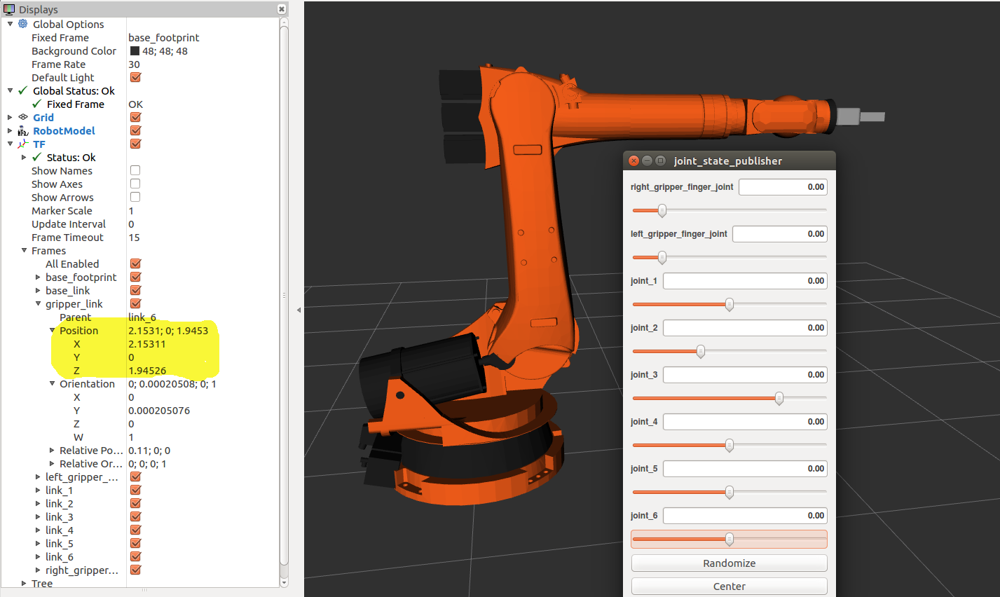
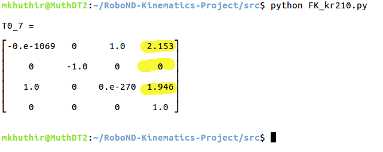
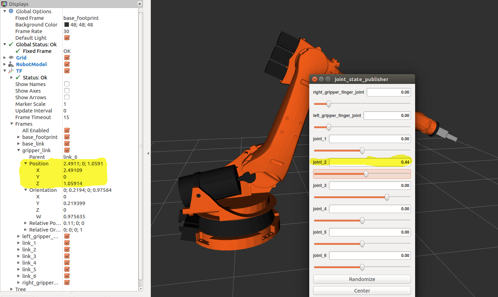
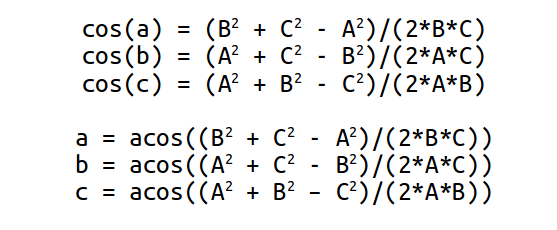

[](https://www.udacity.com/robotics)
# Robotic Arm Pick & Place Project

### Writeup by Muthanna A. Attyah
### Feb 2018

[//]: # (Image References)
[image2]: ./misc_images/misc3.png

## [Rubric](https://review.udacity.com/#!/rubrics/972/view) Points
---

## Forward Kinematic Analysis

### Extracting joint positions and orientations from URDF file.

from the URDF file `kr210.urdf.xacro` we can extract the position xyz and orientation rpy of each joint from **origin** tag in each joint XML section:

for example, from the following fixed base joint XML section:

```xml
 <!-- joints -->
  <joint name="fixed_base_joint" type="fixed">
    <parent link="base_footprint"/>
    <child link="base_link"/>
    <origin xyz="0 0 0" rpy="0 0 0"/>
  </joint>
```
In the **origin** tag:
```xml
<origin xyz="0 0 0" rpy="0 0 0"/>
```
We can see that **xyz="0 0 0"** and **rpy="0 0 0"**. 

Following table is showing complete extracted list for all joints base to gripper:

O | joint | parant | child | x | y | z | r | p | y |
--- | --- | --- | --- | --- | --- | --- | --- | --- | --- |
0 | fixed_base | base_footprint | base_link | 0 | 0 | 0 | 0 | 0 | 0 |
1 | joint_1 | base_link | link_1 | 0 | 0 | 0.33 | 0 | 0 | 0 |
2 | joint_2 | link_1 | link_2 | 0 .35| 0 | 0.42 | 0 | 0 | 0 |
3 | joint_3 | link_2 | link_3 | 0 | 0 | 1.25 | 0 | 0 | 0 |
4 | joint_4 | link_3 | link_4 | 0.96 | 0 | -0.054 | 0 | 0 | 0 |
5 | joint_5 | link_4 | link_5 | 0.54 | 0 | 0 | 0 | 0 | 0 |
6 | joint_6 | link_5 | link_6 | 0.193 | 0 | 0 | 0 | 0 | 0 |
7 | gripper | link_6 | gripper_link | 0.11 | 0 | 0 | 0 | 0 | 0 |
. | **Total (m)** |  |  | **2.153** | 0 | **1.946** | 0 | 0 | 0 |

Now using the above table we can draw the different frames with x and z translations from one frame to another as shown in below figure.

<p align="center">  </p>

Then we can further simplify by combining the last three joints (4,5, and 6) in in joint_5 since their axes in actual KR210 robot intersect at a single point which represent the center of the robot spherical wrist:

<p align="center">  </p>

#### Note that:

**Origin** O(i) = intersection between Xi and Zi axis

**Link Length:** a(i-1) = Zi-1 - Zi along the X(i-1) axis

**Link Offset:** d(i) = X(i-1) - X(i) along Z(i) axis

**Link Twist:** alpha(i-1) = angle from Z(i-1) to Z(i) measured about Xi-1 using right hand rule

**Joint Angle:** theta(i) = angle from X(i-1) to X(i) measured about Zi using right hand rule. all joint angles will be zero at initial Robot state in KR210 except joint 2 which has a -90 degree constant offset between X(1) and X(2).

**Gripper frame:** is the end point that we care about. it is displaced from Frame 6 by a translation along Z(6).


### Kuka KR210 robot DH parameters.

Using the above mentioned formulas we can generate the DH parameters table as following:

Links | i | alpha(i-1) | a(i-1) | d(i) | theta(i) |
:---: | :---: | :---: | :---: | :---: | :---: |
0->1 | 1 | 0 | 0 | 0.75 | q1 |
1->2 | 2 | -90 | 0.35 | 0 | -90+q2 |
2->3 | 3 | 0 |  | 1.25 | q3 |
3->4 | 4 | -90 | -0.05 | 1.5 | q4 |
4->5 | 5 | 90 | 0 | 0 | q5 |
5->6 | 6 | -90 | 0 | 0 | q6 |
6->7 | 7 | 0 | 0 | 0.303 | q7 |

in which q(i) is our input to joint angles (theta(i)).

I will be using python to code the forward kinematics:

To start with, we need the following imports:

```python
import numpy as np
from numpy import array
from sympy import symbols, cos, sin, pi, simplify, sqrt, atan2, pprint
from sympy.matrices import Matrix
```

Python code to represent DH parameters table is:

```python
# DH Table
s = {alpha0:      0, a0:      0, d1:  0.75, q1:        q1,
     alpha1: -pi/2., a1:   0.35, d2:     0, q2: -pi/2.+q2,
     alpha2:      0, a2:   1.25, d3:     0, q3:        q3,
     alpha3: -pi/2., a3: -0.054, d4:  1.50, q4:        q4,
     alpha4:  pi/2., a4:      0, d5:     0, q5:        q5,
     alpha5: -pi/2., a5:      0, d6:     0, q6:        q6,
     alpha6:      0, a6:      0, d7: 0.303, q7:         0}
```

### Creating the individual transformation matrices about each joint:

Using above DH parameter table, we can create individual transforms between various links. DH convention uses four individual transforms: 

<p align="center">  </p>

Using the DH parameter table, we can transform from one frame to another using the following matrix:

<p align="center">  </p>

Python code for a function that will return the individual frame transformation matrix is as following:

```python
# Function to return homogeneous transform matrix

def TF_Mat(alpha, a, d, q):
    TF = Matrix([[            cos(q),           -sin(q),           0,             a],
                 [ sin(q)*cos(alpha), cos(q)*cos(alpha), -sin(alpha), -sin(alpha)*d],
                 [ sin(q)*sin(alpha), cos(q)*sin(alpha),  cos(alpha),  cos(alpha)*d],
                 [                 0,                 0,           0,             1]])
    return TF
```
Then using the following code to subsitute the DH paramaters into the trnasformation matrix: 

```python
   ## Substiute DH_Table
T0_1 = TF_Mat(alpha0, a0, d1, q1).subs(dh)
T1_2 = TF_Mat(alpha1, a1, d2, q2).subs(dh)
T2_3 = TF_Mat(alpha2, a2, d3, q3).subs(dh)
T3_4 = TF_Mat(alpha3, a3, d4, q4).subs(dh)
T4_5 = TF_Mat(alpha4, a4, d5, q5).subs(dh)
T5_6 = TF_Mat(alpha5, a5, d6, q6).subs(dh)
T6_7 = TF_Mat(alpha6, a6, d7, q7).subs(dh)

```

To get the composition of all transforms from base to gripper we simply multiply the individual matricies using the following code:

```python
# Composition of Homogeneous Transforms
# Transform from Base link to end effector (Gripper)
T0_2 = (T0_1 * T1_2) ## (Base) Link_0 to Link_2
T0_3 = (T0_2 * T2_3) ## (Base) Link_0 to Link_3
T0_4 = (T0_3 * T3_4) ## (Base) Link_0 to Link_4
T0_5 = (T0_4 * T4_5) ## (Base) Link_0 to Link_5
T0_6 = (T0_5 * T5_6) ## (Base) Link_0 to Link_6
T0_7 = (T0_6 * T6_7) ## (Base) Link_0 to Link_7 (End Effector)
```

In order to apply correction needed to account for Orientation Difference Between difinition of Gripper Link_7 in URDF versus DH Convention we need to rotate around y then around z axies:

```python
R_y = Matrix([[ cos(-np.pi/2),           0, sin(-np.pi/2), 0],
              [             0,           1,             0, 0],
              [-sin(-np.pi/2),           0, cos(-np.pi/2), 0],
              [             0,           0,             0, 1]])

R_z = Matrix([[    cos(np.pi), -sin(np.pi),             0, 0],
              [    sin(np.pi),  cos(np.pi),             0, 0],
              [             0,           0,             1, 0],
              [             0,           0,             0, 1]])


R_corr = (R_z * R_y)

T_total= (T0_7 * R_corr)
```

To check results we can evaluate the indivdual results when all thetas are equal to zero and compare it to rviz simulator values. I have used prety print (pprint) to show the resulting matrix as shown in below code.

```python
### Numerically evaluate transforms (compare this to output of tf_echo/rviz)

print("\nT0_7 = \n")
pprint(T0_7.evalf(subs={q1: 0, q2: 0, q3: 0, q4: 0, q5: 0, q6: 0}))

```
Remember that the homogeneous transform consists of a rotation part and a translation part as follows:

<p align="center">  </p>

where Px, Py, Pz represent the position of end-effector w.r.t. base_link and RT represent the rotation part using the Roll-Pitch-Yaw angles

In order to compare the output of forward kinematics code with simulator I used the following ROS launch command to run simulator:

```sh
$ roslaunch kuka_arm forward_kinematics.launch
```

Then as shown below; I used RViz tf frames to check values of Px, Py, and Pz in compare to output of python code.

#### Test Case 1: When all thetas = 0 which is the robot initial state.
```python
T0_7.evalf(subs={q1: 0, q2: 0, q3: 0, q4: 0, q5: 0, q6: 0})
```
##### Rviz output:
<p align="center">  </p>

##### Python output:
<p align="center">  </p>

#### Test Case 2: When theta2=0.44 and remaining thetas=0
```python
T0_7.evalf(subs={q1: 0, q2: 0.44, q3: 0, q4: 0, q5: 0, q6: 0})
```
##### Rviz output:
<p align="center">  </p>

##### Python output:
<p align="center">  </p>

[Python code for forward kinematics test `FK_kr210.py` is located on this link](./src/FK_kr210.py)


## Inverse Kinematics Analysis

Since the last three joints in KUKA KR210 robot (Joint_4, Joint_5, and Joint_6) are revolute and their joint axes intersect at a single point (Joint_5), we have a case of spherical wrist with joint_5 being the common intersection point; the wrist center (**WC**). This allows us to kinematically decouple the IK problem into **Inverse Position** and **Inverse Orientation** problems.

### Inverse Position

First step is to get the end-effector poistion(**Px, Py, Pz**) and orientation (**Roll, Pitch, Yaw**) from the test cases data class as shown in below code:

```python
    # Requested end-effector (EE) position
    px = req.poses[x].position.x
    py = req.poses[x].position.y
    pz = req.poses[x].position.z
    
    # store EE position in a matrix
    EE = Matrix([[px],
                 [py],
                 [pz]])
    
    # Requested end-effector (EE) orientation
    (roll,pitch,yaw) = tf.transformations.euler_from_quaternion(
        [req.poses[x].orientation.x,
         req.poses[x].orientation.y,
         req.poses[x].orientation.z,
         req.poses[x].orientation.w])
```

We will need rotation matrix for the end-effector:

**R_rpy = Rot(Z, yaw) * Rot(Y, pitch) * Rot(X, roll)**

and orientation difference correction matrix (Rot_corr) as earlier discussed in FK section.

**R_EE = R_rpy * R_corr**

We substiute the obtained roll, pitch and yaw in the final rotation matrix. Python Code is as following:

```python
 # Find EE rotation matrix RPY (Roll, Pitch, Yaw)
    r,p,y = symbols('r p y')

    # Roll
    ROT_x = Matrix([[       1,       0,       0],
                    [       0,  cos(r), -sin(r)],
                    [       0,  sin(r),  cos(r)]])
    # Pitch
    ROT_y = Matrix([[  cos(p),       0,  sin(p)],
                    [       0,       1,       0],
                    [ -sin(p),       0,  cos(p)]])
    # Yaw
    ROT_z = Matrix([[  cos(y), -sin(y),       0],
                    [  sin(y),  cos(y),       0],
                    [       0,       0,       1]])

    ROT_EE = ROT_z * ROT_y * ROT_x

    # Correction Needed to Account for Orientation Difference Between
    # Difinition of Gripper Link_G in URDF versus DH Convention

    ROT_corr = ROT_z.subs(y, radians(180)) * ROT_y.subs(p, radians(-90))
    
    ROT_EE = ROT_EE * ROT_corr
    ROT_EE = ROT_EE.subs({'r': roll, 'p': pitch, 'y': yaw})
```

The obtained matrix will be the rotation part of the full homogeneous transform matrix as yellow highlited in the following:

<p align="center">  </p>

where **l**, **m** and **n** are orthonormal vectors representing the end-effector orientation along X, Y, Z axes of the local coordinate frame.

<p align="center">  </p>

Since **n** is the vector along the **z-axis** of the **gripper_link**, we can say the following:

<p align="center">  </p>

Where,

**Px, Py, Pz** = end-effector positions optrained from test case data

**Xwc, Ywc, Zwc** = wrist center positions that we are trying to find.

**d6** = link_6 length obtained from DH table (d6=0)

**d7** = end-effector length obtained from DH table (d7=0.303)

The same equation in vectorized version (d is the displacement):

<p align="center">  </p>

In Python code:

```python
    # Calculate Wrest Center
    WC = EE - (0.303) * ROT_EE[:,2]
```
WC is now having position of wrist center (Wx, Wy, Wz).

To find 𝜃1, we need to project Wz onto the ground plane Thus,

**Theta1=atan2(Wy,Wx)**

```python
    # Calculate theat1
    theta1 = atan2(WC[1],WC[0])
```
Using trigonometry, we can calculate **𝜃2 and 𝜃3**. 

We have a triangle (the green color in below figure) with two sides known to us (**A** = d4 = 1.5) and (**C** = a2 = 1.25), the 3rd side (**B**) can be calcualted as following:

Below is the same in Python code:

```python
    #SSS triangle for theta2 and theta3
    A = 1.501
    C = 1.25
    B = sqrt(pow((sqrt(WC[0]*WC[0] + WC[1]*WC[1]) - 0.35), 2) + pow((WC[2] - 0.75), 2))
``` 
Now since we have all three sides of the trianlge known to us we can calculate all of the three inner angles of the traingle from the known three sides Using trigonometry (specifically the **Cosine Laws** SSS type).

<p align="center">  </p>

The same in Python code:

 ```python
    a = acos((B*B + C*C - A*A) / (2*B*C))
    b = acos((A*A + C*C - B*B) / (2*A*C))
    c = acos((A*A + B*B - C*C) / (2*A*B))
```


```python
    theta2 = pi/2 - a - atan2(WC[2]-0.75, sqrt(WC[0]*WC[0]+WC[1]*WC[1])-0.35)
    theta3 = pi/2 - (b+0.036) # 0.036 accounts for sag in link4 of -0.054m
```
<p align="center">  </p>

### Inverse Orientation

For the **Inverse Orientation** problem, we need to find values of the final three joint variables **𝜃4, 𝜃5 and 𝜃6**.

Using the individual DH transforms we can obtain the resultant transform and hence resultant rotation by:

**R0_6 = R0_1*R1_2*R2_3*R3_4*R4_5*R5_6**

Since the overall RPY (Roll Pitch Yaw) rotation between base_link and gripper_link must be equal to the product of individual rotations between respective links, following holds true:

**R0_6 = R_EE**

where,

**R_EE** = Homogeneous RPY rotation between base_link and gripper_link as calculated above.

We can substitute the values we calculated for **𝜃1, 𝜃2 and 𝜃3**. in their respective individual rotation matrices and pre-multiply both sides of the above equation by **inv(R0_3)** which leads to:

**R3_6 = inv(R0_3) * R_EE**

The resultant matrix on the RHS (Right Hand Side of the equation) does not have any variables after substituting the joint angle values, and hence comparing LHS (Left Hand Side of the equation) with RHS will result in equations for **𝜃4, 𝜃5 and 𝜃6**.

```python
    # Extract rotation matrix R0_3 from transformation matrix T0_3 the substiute angles q1-3
    R0_3 = T0_1[0:3,0:3] * T1_2[0:3,0:3] * T2_3[0:3,0:3]
    R0_3 = R0_3.evalf(subs={q1: theta1, q2: theta2, q3:theta3})

    # Get rotation matrix R3_6 from (inverse of R0_3 * R_EE)
    R3_6 = R0_3.inv(method="LU") * ROT_EE
```


```python
    # Euler angles from rotation matrix
    theta4 = atan2(R3_6[2,2], -R3_6[0,2])
    theta5 = atan2(sqrt(R3_6[0,2]*R3_6[0,2] + R3_6[2,2]*R3_6[2,2]),R3_6[1,2])
    theta6 = atan2(-R3_6[1,1],R3_6[1,0])
```

Also I have added to the forward kinematics code to help in checking for errors.

```python
FK = T0_7.evalf(subs={q1:theta1,q2:theta2,q3:theta3,q4:theta4,q5:theta5,q6:theta6})
```

The rest of the code will utilize wrist center position **WC** and the **thetas** to calculate the corresponding errors. Using these error values as a basis, We can guage how well our current IK performs.

I have added one line of code to print out the test case number. rest of the code is as provided.

```python
    # Print test case number
    print ("Using Test Case Number %d" %test_case_number)
```

The output of all 3 provided test cases are as following:

### Test Case 1 output:

```
Total run time to calculate joint angles from pose is 0.6331 seconds
Using Test Case Number 1

Wrist error for x position is: 0.00000046
Wrist error for y position is: 0.00000032
Wrist error for z position is: 0.00000545
Overall wrist offset is: 0.00000548 units

Theta 1 error is: 0.00093770
Theta 2 error is: 0.00181024
Theta 3 error is: 0.00205031
Theta 4 error is: 0.00172067
Theta 5 error is: 0.00197873
Theta 6 error is: 0.00251871

**These theta errors may not be a correct representation of your code, due to the fact            
that the arm can have muliple positions. It is best to add your forward kinmeatics to            
confirm whether your code is working or not**
 

End effector error for x position is: 0.00002010
End effector error for y position is: 0.00001531
End effector error for z position is: 0.00002660
Overall end effector offset is: 0.00003668 units 
```


### Test Case 2 output:

```
Total run time to calculate joint angles from pose is 0.6635 seconds
Using Test Case Number 2

Wrist error for x position is: 0.00002426
Wrist error for y position is: 0.00000562
Wrist error for z position is: 0.00006521
Overall wrist offset is: 0.00006980 units

Theta 1 error is: 3.14309971
Theta 2 error is: 0.27930449
Theta 3 error is: 1.86835102
Theta 4 error is: 3.08639294
Theta 5 error is: 0.06340564
Theta 6 error is: 6.13524247

**These theta errors may not be a correct representation of your code, due to the fact            
that the arm can have muliple positions. It is best to add your forward kinmeatics to            
confirm whether your code is working or not**
 

End effector error for x position is: 0.00002566
End effector error for y position is: 0.00002581
End effector error for z position is: 0.00000461
Overall end effector offset is: 0.00003668 units 
```

### Test Case 3 output:

```
Total run time to calculate joint angles from pose is 0.6569 seconds
Using Test Case Number 3

Wrist error for x position is: 0.00000503
Wrist error for y position is: 0.00000512
Wrist error for z position is: 0.00000585
Overall wrist offset is: 0.00000926 units

Theta 1 error is: 0.00136747
Theta 2 error is: 0.00325738
Theta 3 error is: 0.00339563
Theta 4 error is: 6.28212730
Theta 5 error is: 0.00284405
Theta 6 error is: 6.28223850

**These theta errors may not be a correct representation of your code, due to the fact            
that the arm can have muliple positions. It is best to add your forward kinmeatics to            
confirm whether your code is working or not**
 

End effector error for x position is: 0.00000069
End effector error for y position is: 0.00000011
End effector error for z position is: 0.00003668
Overall end effector offset is: 0.00003668 units 
```

[Python code for forward kinematics test `IK_debug.py` is located on this link](./src/IK_debug.py)

### Project Implementation

#### 1. Fill in the `IK_server.py` file with properly commented python code for calculating Inverse Kinematics based on previously performed Kinematic Analysis. Your code must guide the robot to successfully complete 8/10 pick and place cycles. Briefly discuss the code you implemented and your results. 

IK_server.py must contain properly commented code. The robot must track the planned trajectory and successfully complete pick and place operation. Your writeup must include explanation for the code and a discussion on the results.


[Python code for forward kinematics test `IK_server.py` is located on this link](./src/kuka_arm/scripts/IK_server.py)


### Issues faced during project

* Handling VMWare virtual machine image was difficult considering its big size (4.5+GB compressed and 12+ GB uncompressed). I decided to install ROS Kinetics and Gazebo 7.9 on Ubuntu 16.04 LTS with all its required dependencies and updates. It took me some time but I felt that it was much more beneficial in learning Ubuntu/ROS/Gazebo/RViz installation, update, upgrade, and package management tricks.

* Slowness of the forward and inverse kinematics was one of the issues I faced at the initial stage of the code writing/testing. I was able to improve performance by removing unwanted sympy "simplify" calls then further improve it by converting some of the parts from sympy to numpy [see this link for more info.](https://stackoverflow.com/questions/45796747/are-sympy-matrices-really-that-slow).


### Future improvements

* I recommend adding ROS/Ubuntu/Gazebo manual installation as one of the supported platforms for this ND and show required steps which will be a great addon value for students to learn how to install those great tools on their own PCs or DevBoards. Starting a new dedicated ROS NanoDegree will be great, and for sure I will be one of the first to enroll in it.

### Standout submission
To have a standout submission, calculate and plot the error in end-effector pose generated by your joint angle commands. You can do this by calculating end-effector poses via Forward Kinematics using your code output (which is a set of joint angles) and comparing it with the end-effector poses you received as input.
